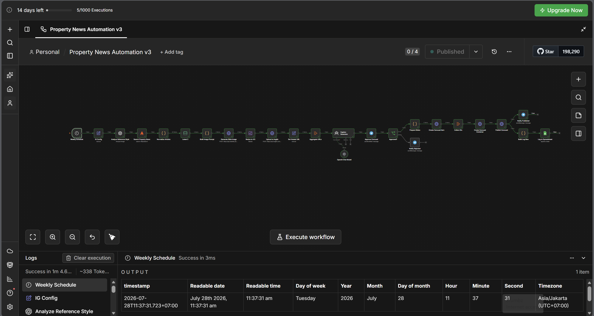
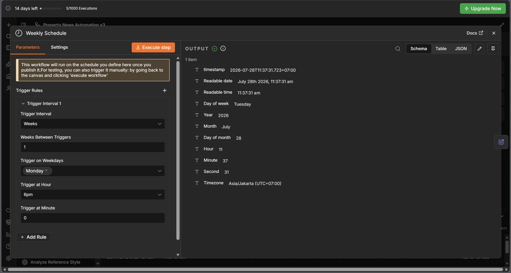

# 🏡 QProperty — AI-Powered Instagram Carousel Automation


An end-to-end **AI-powered content automation workflow** built with **n8n** that automatically creates and publishes weekly Instagram carousel posts for **QProperty**.

The workflow searches the latest Indonesian property news, generates branded carousel images, writes an Instagram caption using AI, requests human approval through Telegram, publishes the carousel to Instagram, and logs every published post to Google Sheets.



---

# ✨ Features

- 📰 Search the latest Indonesian property & real estate news
- 🤖 Generate AI-powered Instagram captions
- 🎨 Generate branded carousel images
- 🖼 Automatically resize images to Instagram format (1080×1350)
- ☁ Upload images to imgbb
- ✅ Human approval via Telegram before publishing
- 📱 Publish Instagram Carousel through Facebook Graph API
- 📊 Log every published post into Google Sheets
- ⏰ Fully automated weekly schedule

---

# 🏗 Workflow Architecture

```text
Weekly Schedule
      │
      ▼
Analyze Brand Style (OpenAI Vision)
      │
      ▼
Search Property News (Firecrawl)
      │
      ▼
Normalize & Select Headlines
      │
      ▼
Generate AI Image Prompts
      │
      ▼
Generate Carousel Images (Stability AI)
      │
      ▼
Resize Images (1080×1350)
      │
      ▼
Upload Images (imgbb)
      │
      ▼
Generate Caption (OpenAI)
      │
      ▼
Telegram Approval
      │
 ┌────┴─────┐
 │          │
Reject   Approve
 │          │
 ▼          ▼
Notify   Publish Carousel
              │
              ▼
      Google Sheets Logging
```

---

# 📦 Workflow Information

| Item | Value |
|------|-------|
| Platform | n8n |
| Trigger | Weekly Schedule |
| Frequency | Every Monday 18:00 |
| Output Language | Bahasa Indonesia |
| Workflow ID | `MtCrq6JzMC72Z1ad` |

---

# 🧩 Workflow Nodes

| Node | Purpose |
|------|---------|
| Weekly Schedule | Triggers the workflow every Monday |
| IG Config | Stores Instagram ID, brand name, reference image |
| Analyze Reference Style | Extracts reusable visual style from a reference image |
| Search Property News | Retrieves the latest Indonesian property news |
| Normalize Articles | Cleans Firecrawl search results |
| Latest Headlines | Keeps the top headlines |
| Build Image Prompt | Creates AI prompts for each carousel slide |
| Generate Slide Image | Generates branded images using Stability AI |
| Resize Image | Converts images to Instagram portrait format |
| Upload to imgbb | Hosts generated images |
| Caption Generator | Generates Instagram captions using OpenAI |
| Telegram Approval | Sends preview for manual approval |
| Publish Carousel | Publishes Instagram carousel |
| Google Sheets Logger | Records published posts |

---

# ⚙ Configuration

The **IG Config** node contains all editable values.

| Field | Description |
|------|-------------|
| `brand_name` | Displayed brand name |
| `ig_user_id` | Instagram Business Account ID |
| `ref_image_url` | Reference design used for style consistency |

### Number of slides

Modify the **Latest Headlines** node (`maxItems`).

### Schedule

Configured in **Weekly Schedule** every **Monday at 18:00**.



### News Query

Configured in **Search Property News**.

Example:

```
berita properti Indonesia terbaru
```

---

# 🔑 Required Credentials

| Service | Purpose |
|---------|---------|
| OpenAI API | Caption generation & image style analysis |
| Firecrawl API | News search |
| Stability AI API | Image generation |
| imgbb API | Image hosting |
| Facebook Graph API | Instagram publishing |
| Telegram Bot API | Approval workflow |
| Google Sheets OAuth | Logging |

---

# 📊 Google Sheets Schema

Create the following header row:

| Column |
|--------|
| published_at |
| brand |
| post_id |
| caption |
| image_urls |
| news_headlines |

The workflow automatically appends new rows.

---

# ✅ Approval Flow

Before publishing, Telegram sends a preview with:

- ✅ Approve & Post
- ❌ Reject

If approved:

- Instagram carousel is published
- Telegram confirmation is sent
- Google Sheets log is created

If rejected:

- Nothing is published
- Telegram rejection notification is sent

---

# 🚀 Installation

1. Clone this repository.

```bash
git clone https://github.com/yourusername/qproperty-instagram-automation.git
```

2. Import `workflow.json` into n8n.

3. Configure all required credentials.

4. Update the **IG Config** node.

5. Activate the workflow.

---

# 📁 Repository Structure

```
.
├── README.md
├── workflow.json
├── docs/
│   ├── workflow.png
│   └── architecture.png
├── images/
└── .env.example
```

---

# 🛠 Tech Stack

- n8n
- OpenAI GPT
- Firecrawl
- Stability AI
- Facebook Graph API
- Telegram Bot API
- Google Sheets API
- imgbb

---

# 📌 Notes

- Requires an Instagram Business or Creator account.
- Facebook Graph permissions must be approved.
- Generated content is written in Bahasa Indonesia.
- Images are temporarily hosted on imgbb before publishing.

---

# 📄 License

MIT License

---

## ⭐ If you find this workflow useful, consider giving this repository a star!
